# 🏗️ ModulantJS Architecture

## 🌐 System Overview

ModulantJS is a distributed client-side proxy tool that enables transparent request interception and routing through a hidden iframe mechanism. This document details its architecture, components, and use cases.

## 🔄 Core Components

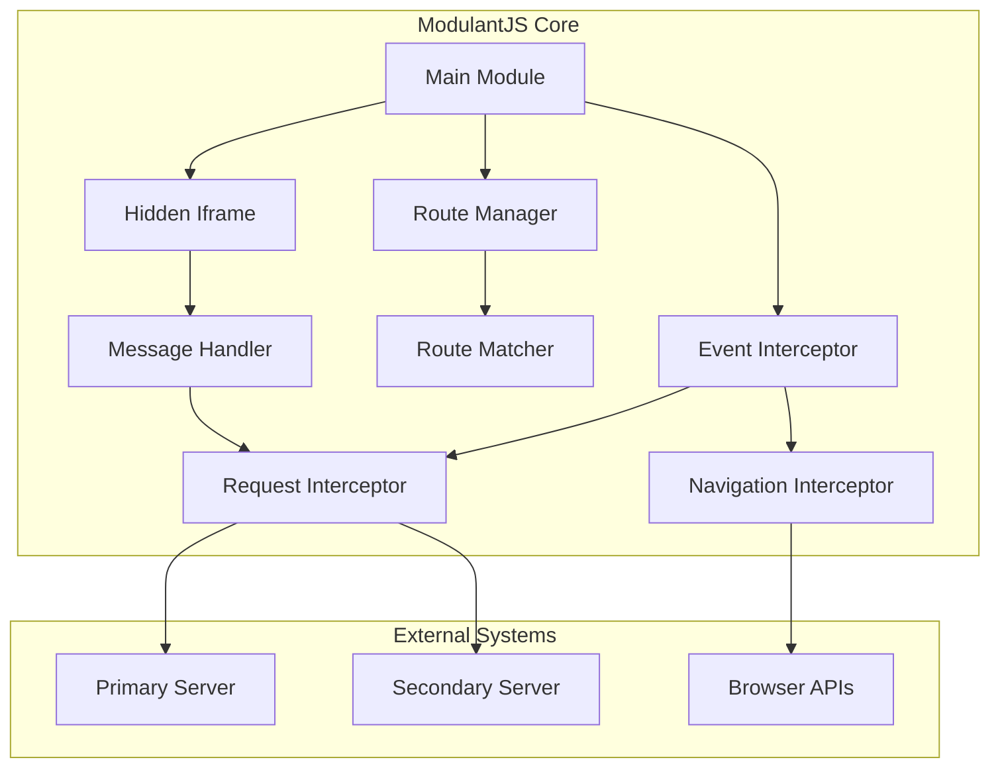

### Component Details

#### 🎯 Main Module
- Initializes the framework
- Manages configuration
- Orchestrates component interactions

#### 🖼️ Hidden Iframe
- Acts as proxy layer
- Handles cross-origin requests
- Maintains isolated context

#### 🛣️ Route Manager
- Processes routing rules
- Matches requests to routes
- Determines request destinations

#### 🎭 Event Interceptor
- Captures browser events
- Intercepts navigation
- Handles user interactions

## 🔄 Request Flow

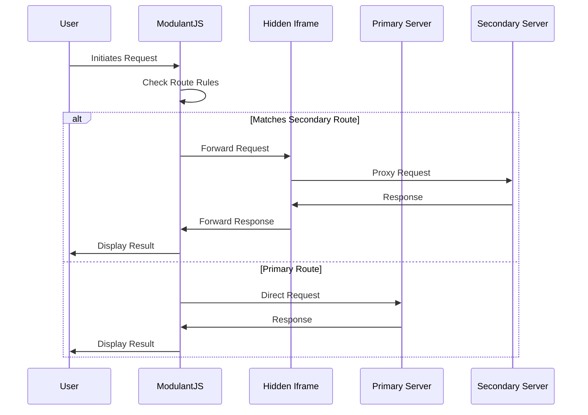

## 🎯 Use Cases

### 1️⃣ API Request Interception

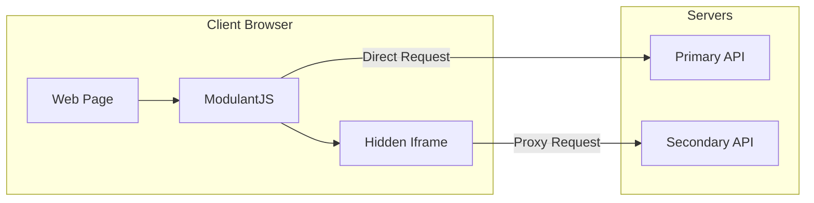

#### Implementation Flow
1. Client makes API request
2. ModulantJS intercepts request
3. Route rules determine destination
4. Request proxied through iframe if needed
5. Response returned to client

### 2️⃣ Navigation Handling

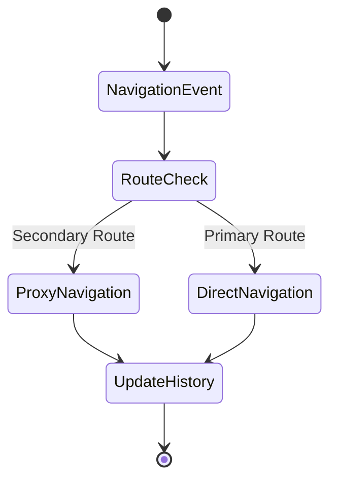

#### Key Features
- Link click interception
- History API integration
- Transparent URL handling
- State preservation

### 3️⃣ Custom Script Injection

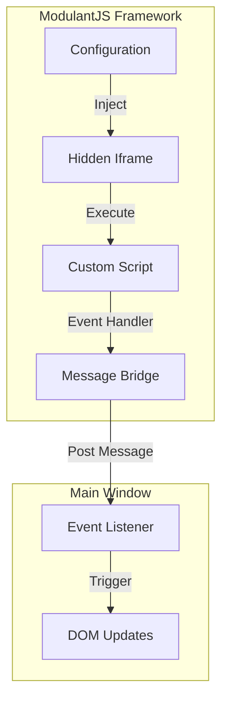

## 🔒 Security Model

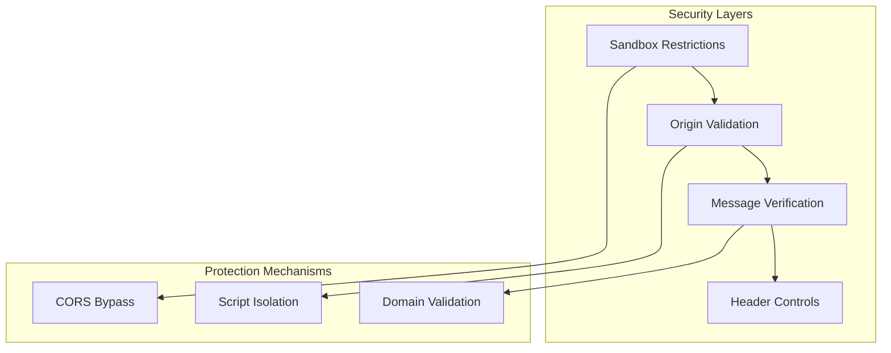

### Security Features
- Iframe sandboxing
- Origin validation
- Message verification
- Header controls
- Script isolation

## 🔧 Configuration Structure

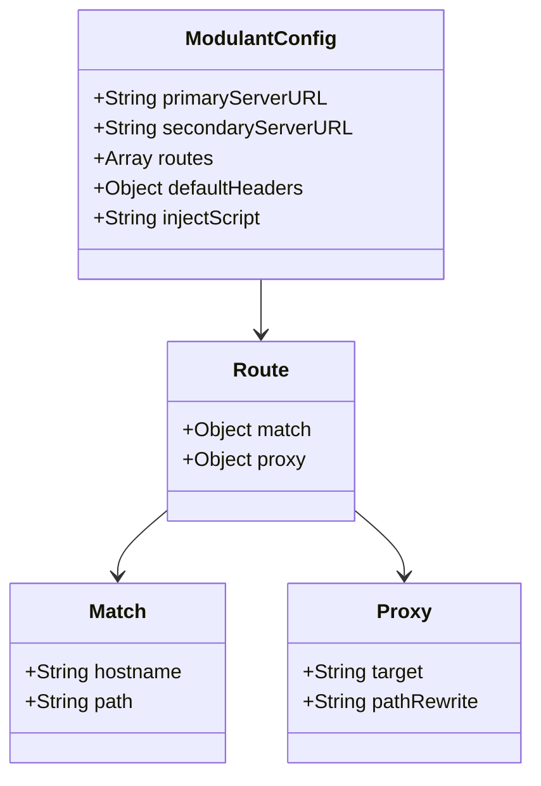

## 🔄 State Management

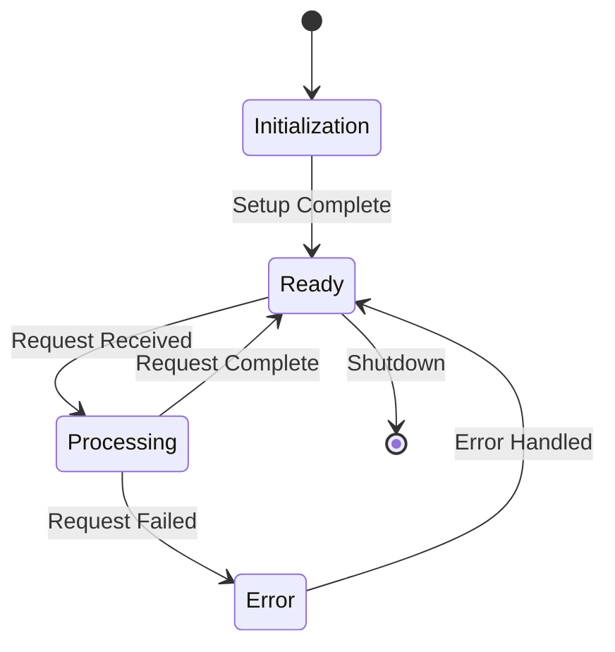

### State Transitions
1. **Initialization**
   - Load configuration
   - Create iframe
   - Setup interceptors

2. **Ready**
   - Listen for events
   - Monitor navigation
   - Handle requests

3. **Processing**
   - Route requests
   - Proxy communication
   - Handle responses

4. **Error**
   - Catch exceptions
   - Log errors
   - Recover state

## 📊 Performance Considerations

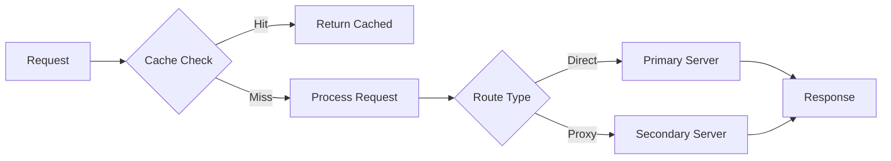

### Optimization Strategies
1. **Request Caching**
   - Cache responses
   - Reuse connections
   - Minimize overhead

2. **Resource Management**
   - Efficient routing
   - Connection pooling
   - Memory optimization

## 🔍 Debugging and Monitoring

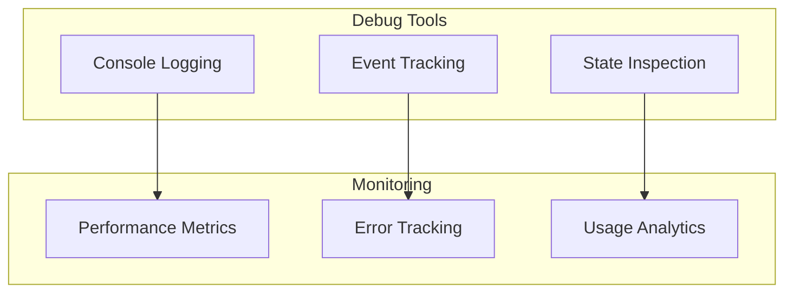

### Debug Features
- Verbose logging
- Event tracking
- State inspection
- Performance monitoring
- Error reporting

## 🚀 Deployment Scenarios

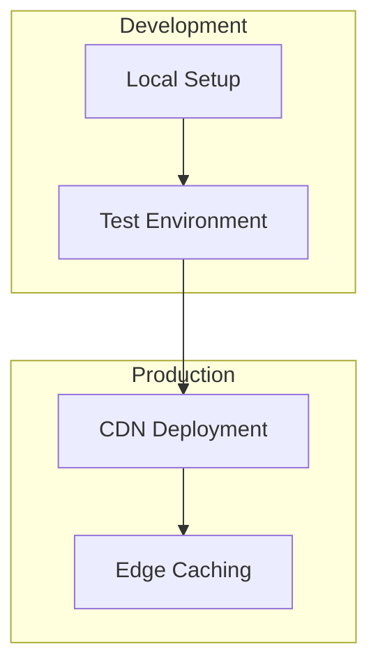

### Deployment Options
1. **Development**
   - Local testing
   - Integration testing
   - Debug mode

2. **Production**
   - CDN distribution
   - Edge caching
   - Production mode
